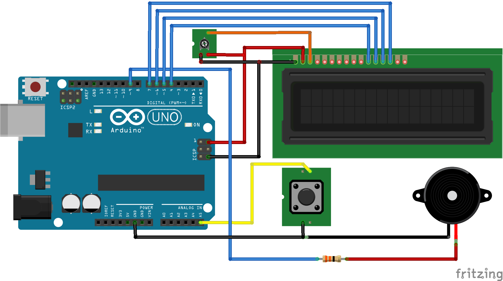

# G-Shock Reflex

🎮 Jogo de reflexo para Arduino UNO, inspirado no G-Shock! Dois jogadores disputam quem tem o melhor tempo de reação.

## 📷 Circuito

## ⚡ Funcionalidades
- LCD 16x2 com RS, EN, D4-D7 ligados no UNO
- Botão em A5 (INPUT_PULLUP)
- Buzzer em D9 para bips e música de vitória
- Melhor de 10 rodadas para cada jogador
- Reinício inteligente com ponteiro de função `funcao_Reset()`

## 👨‍💻 Autores
Duni Saraiva & ChatGPT (OpenAI)

---
MIT License
